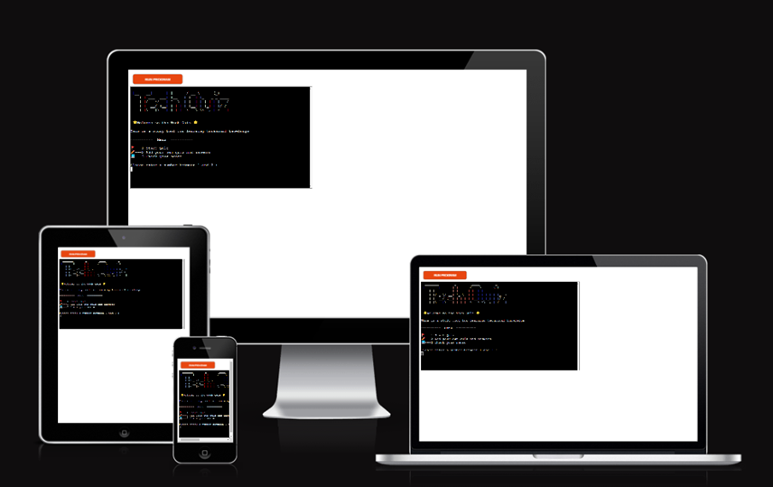

# Tech Quiz

GitHub https://github.com/Chikayo-k/tech-quiz

## Project Goals

The goal of this project is to create a simple and interactive Python game where users can test their programming skills and knowledge.

## Target Audience

- Students studying in the Software Development and Engineering
- Professionals looking to up skills in new technology stacks
- Teachers as a means to help students learn the basics of programming
