# Tech Quiz

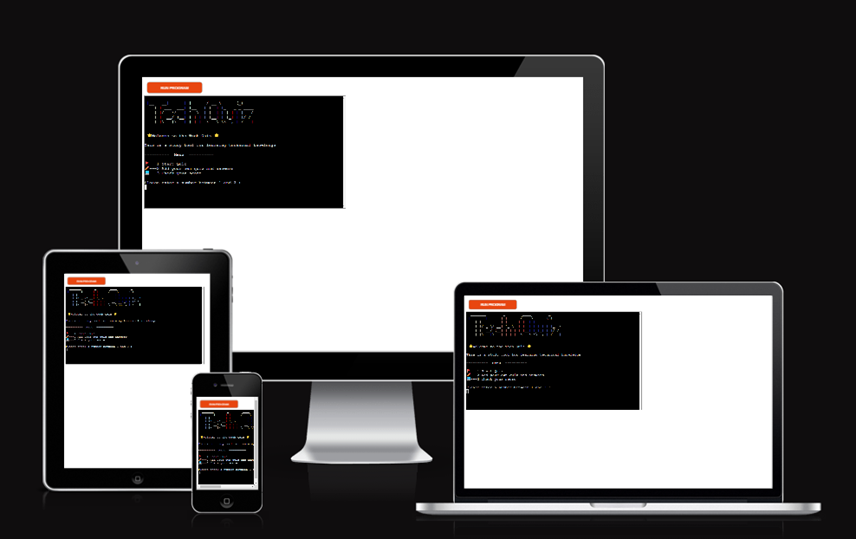
GitHub https://github.com/Chikayo-k/tech-quiz

## Project Goals

The goal of this project is to create a simple and interactive Python game where users can test their programming skills and knowledge.

## Target Audience

- Students studying in the Software Development and Engineering
- Professionals looking to up skills in new technology stacks
- Teachers as a means to help students learn the basics of programming

## User Goals

- Students looking to learn programming knowledge
- Teachers as a learning tool in the classroom
- Professionals looking to learn new knowledge and up-skill
- Short focused quiz to help build programming knowledge
- Provides users with different levels of difficulty
- Provides users with the option to create their own quizzes

## User Stories

Game

1. As a user I want to build my knowledge around programming terms and topics
2. As a user I want to see the menu so I can select an option
3. As a user I want to be able to track my attempts
4. As a user I want to be able to have different levels of difficulty to help me progress.
5. As a user I want to be able to build my own quizzes to learn new things
6. As a user I want a simple experience when answering questions.
7. As a user I want instant visual feedback when answering questions.
8. As a user I want to see my score at the end of each round.

Scoreboard

9. As a user I want to see my scores
10. As a user I want to see my average score

Adding Questions

11. As a user I want to add new questions
12. As a user I want to choose the level where the questions will go
13. As a user I want easy navigation when adding questions
14. As a user I want to see a success message to let me know that a question has been added to the quiz

## Features To Achieve These Goals

Game

1. Provide a technical quiz game
2. Provide users with a menu.
3. Provide users with a scorer board to track the attempts
4. Provide different levels of difficulty
5. Provide users the option to add their questions and add them to the existing quizzes
6. Provide a simple and quick way of answering questions
7. Provide visual feedback in the form of emojis.
8. Provide the user with their score at the end of each set of questions

Scoreboard

9. Provide the last 5 scores.
10. Provide the user with an average score from the last 5 attempts

Adding Questions

11. Provide the user with the option to add new questions to the quiz
12. Provide the user the option where to add the questions in the easy or hard quizzes
13. Provide the user simple way to add questions
14. Provide the user with a message so they know the questions has been added successfully.

## Features

### Home Screen

- Has a welcome message to users what the application is for.
- Display the home screen menu
- Gives the user 3 options to choose from
- The three options are to start the game, Check their score or add questions to create their own quiz.

Using text art and emojis the user can get the feeling it is a game. The welcome screen shows the user what kind of quiz this is and what they can expect.  
The game was designed so that users can enjoy the quiz with minimal input. Using only the number pad they can choose from 3 different options.

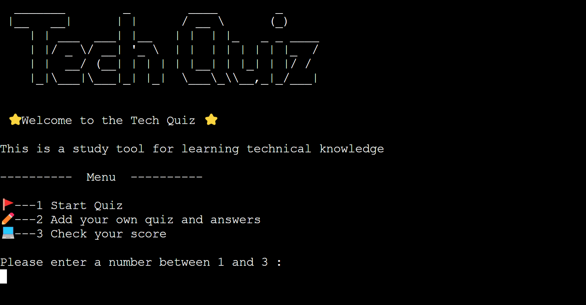

### Start Quiz

- Easy mode
- Hard mode

The user can select from either easy or hard depending on their skill level. The questions will be pulled from an external spreadsheet using the google spreadsheet API. Which contains sets of questions for each.

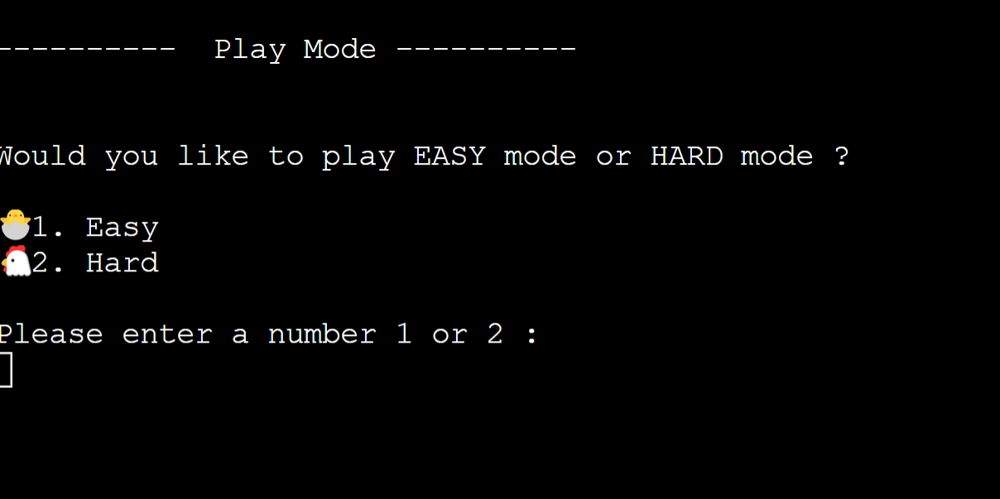

- Display text art
- The questions will display on the screen and ask the user to enter either true or false by choosing either 1 or 2.

Using text art the user can see this is the start of the game.
This is again to simplify the user's experience by only having 2 options to choose from.

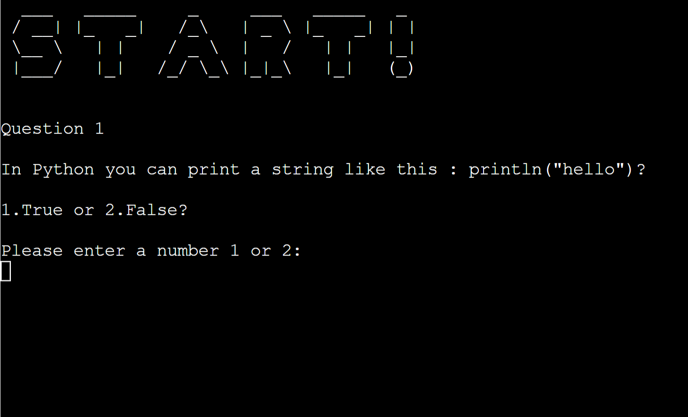

- When the user selects a correct answer they will see a short message with a green tick to let them know it's right
- When the user selects an incorrect answer they will see a short message with a red x to let them know it's wrong
- Provides the user with a short description of the answer.
- Enter to next question

This will allow the user to see if they are making progress in the quiz by showing either a green tick or a red x and provide them with clear and quick feedback.
From the short description, the user can learn a bit more about the topic.
The enter next question will let the user stay and read the description for as long as they want.

Collect  
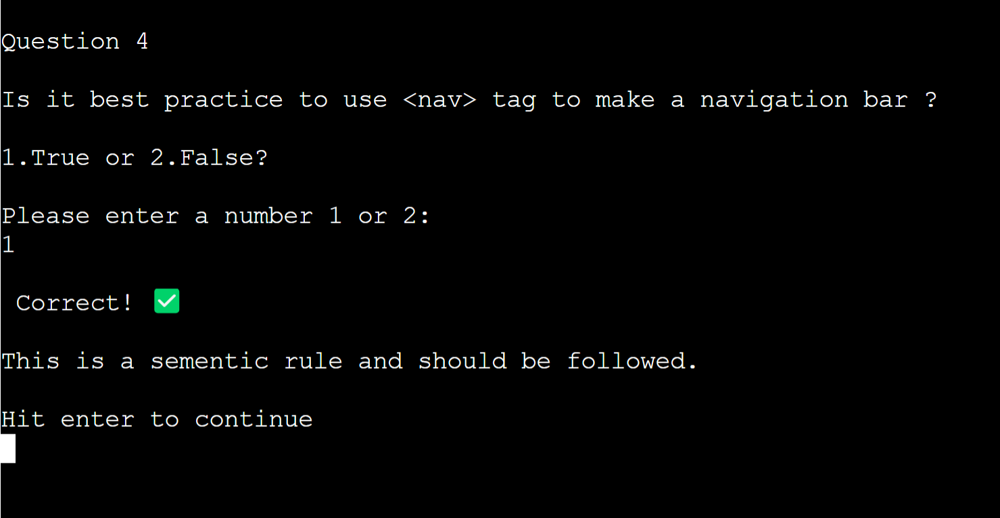

Wrong  
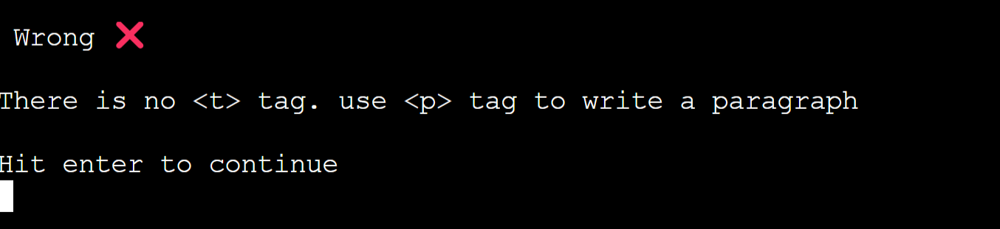

- Text art to show the user they are on the score section
- Show the score at the end of the game
- Ask the user if they would like to play again

This will let the user see the progress they are making at the end of each game. It uses the number pad to simplify the selection for the users. By adding in text art and emojis it gives the user the feel of a game.

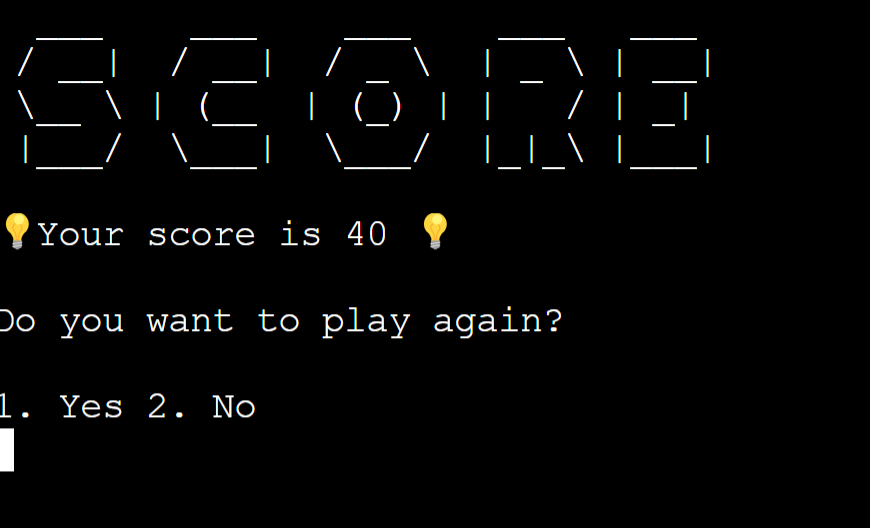

### Add Quiz

- Text art to show the user they are on the add quiz section
- Ask the user what mode of the quiz they want to add a question to or go back to the home screen.

Users will see that this is the add quiz section by looking at the text art.
Users will have the option to add questions to either the easy or hard mode.
Having a home button increases user's accessibility in the game

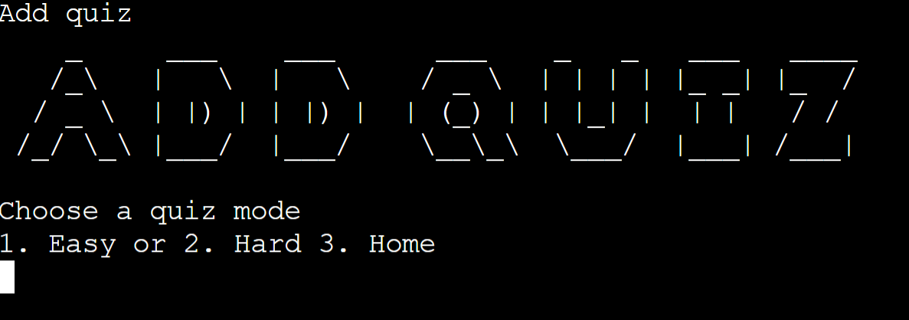

Display the “Please enter a question here” shows clearly what needs to be entered here.
The lead message shows on the screen which provides easy navigation for users

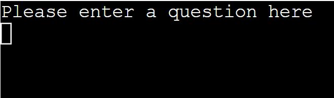

Once a user has entered a question they will need to set the answer to be true or false. This is done by simply selecting either 1 or 2

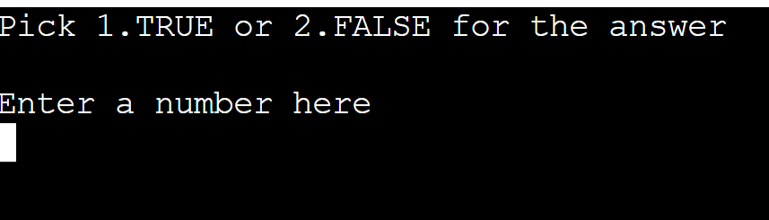

Description can be added. This is users choice.

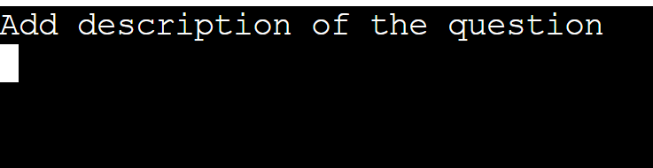

When a question's answer and description have been successfully set it will display a success message. Which user can see the input feedback?

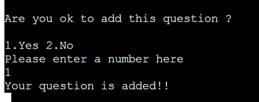

After adding a question the user will be asked if they would like to add another question that lets the user add as many questions as they want.

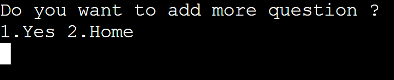

### Scoreboard

- Text art shows this is the score section.
- This will display the last five score attempts the user has made.
- The scores are ordered from oldest to newest with the oldest attempt being no 1 and the last attempt being no 5.
- There is an average score calculated by the last five scores.
- User can return home by entering the enter key.

Users will see this is the score section from the text art.  
Users will be able to track the attempts they have made and see how they are doing.  
User will be able to see their scores in a list from the oldest down to the newest.  
Users can see the average which can help give them an idea of how they are doing on the quizzes.  
Users can simply navigate to the home screen by hitting the enter key.

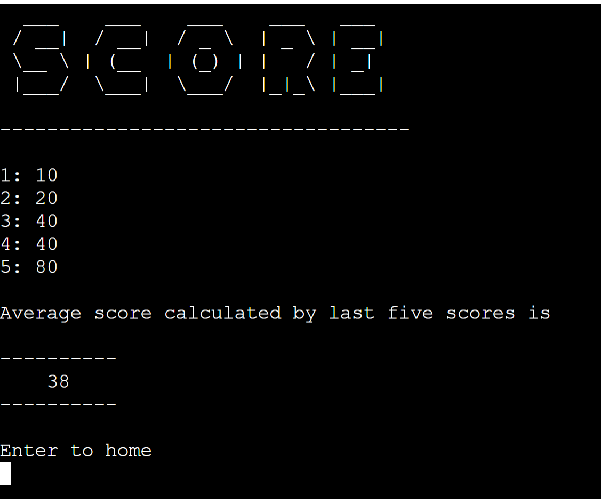

## Data Model

A Google Sheet was used to store the game data.
There are three worksheets for easy game mode, hard game mode and the score to store.

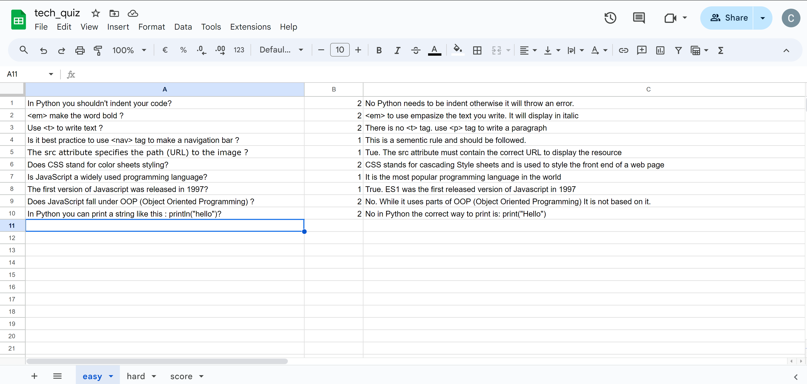

## Technologies

- Python 3
- Google spreadsheet API
- Heroku - backend deployment
- GitHub - version and source control

## Testing / Bugs

### Python Linter

White space, and blank lines issues are solved by using [Python formatter](https://codebeautify.org/python-formatter-beautifier).

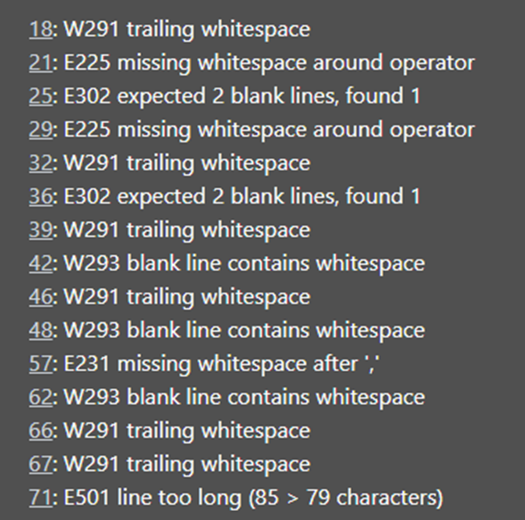

The E501 error came up because the code was being too long.
I fixed the error by adjusting the word of the length.

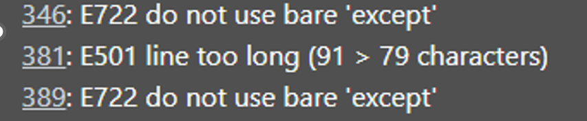

There was an error in using bare except.

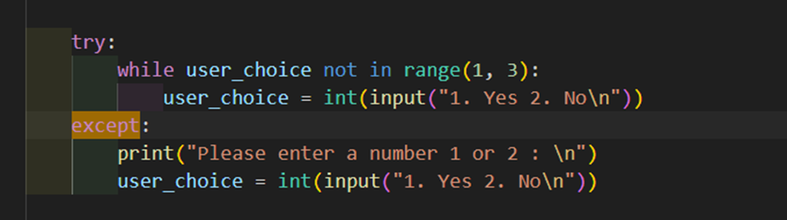

To fix it, catch the errors with Valid error “as” e.
This solved the issue when testing.

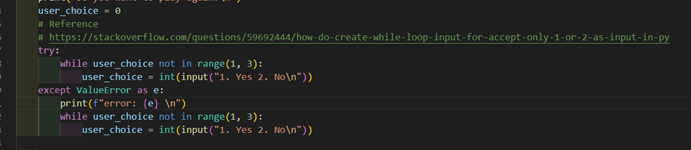

The bare expect issue was fixed but when the user does not type numbers more than twice the error shows up and the game will be stopped. Finally, this was resolved by using the if elif statement.

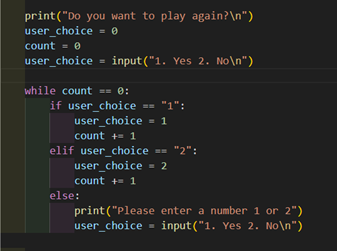

All the errors are fixed. Now there is no error.

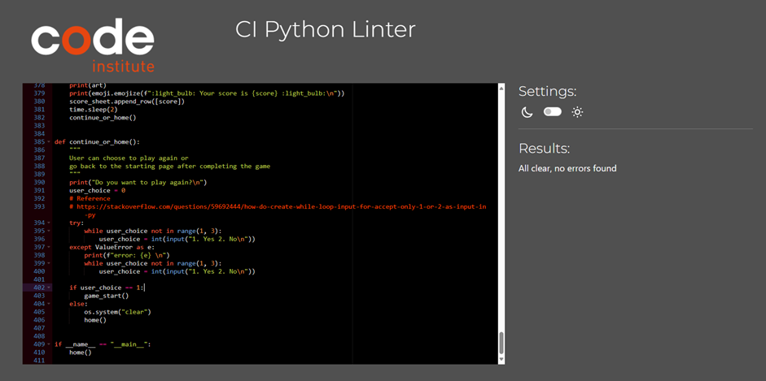

## Browser Test

The application is deployed using Heroku as part of testing the deployed version of the application It was checked on Google Chrome, Edge, and Firefox and all worked and functioned as expected.

## Features Test

### Home Menu Section

| **Feature**                                                                                                   | **Result** |
| ------------------------------------------------------------------------------------------------------------- | ---------- |
| Tested home screen display correctly.                                                                         | Pass       |
| Tested input 1 in the home display brings users to the game section.                                          | Pass       |
| Tested input 2 in the home brings users to the add quiz section.                                              | Pass       |
| Tested in input 3 will display the scoreboard.                                                                | Pass       |
| Tested if user input is between 1 – 3 and if not displays a message indicating to use a number between 1 – 3. | Pass       |

### Game section

| **Feature**                                                                                                                | **Result** |
| -------------------------------------------------------------------------------------------------------------------------- | ---------- |
| Tested if users can select easy mode or hard mode.                                                                         | Pass       |
| Tested quizzes are created from the user-chosen mode.                                                                      | Pass       |
| Tested quizzes are shown randomly from the spreadsheet.                                                                    | Pass       |
| Tested if user input of answer works properly.                                                                             | Pass       |
| Tested when a correct answer is selected.                                                                                  | Pass       |
| Tested when an incorrect answer is selected.                                                                               | Pass       |
| Tested the description of the quiz is correct after the user answers the question when it is available in the spreadsheet. | Pass       |
| Tested after five questions, it will display the score of the current attempt.                                             | Pass       |
| Tested that the displayed score is added to the spreadsheet.                                                               | Pass       |
| Tested user can choose to play again or return home.                                                                       | Pass       |

### Add question

| **Feature**                                                                                                                              | **Result** |
| ---------------------------------------------------------------------------------------------------------------------------------------- | ---------- |
| Tested user can select which mode to add their questions to.                                                                             | Pass       |
| Tested when a question is entered it will display a success message.                                                                     | Pass       |
| Tested when setting the answer to either 1 or 2 (True or False) it displays a success message.                                           | Pass       |
| Tested when a description is entered it will display a success message.                                                                  | Pass       |
| Tested when a description is not entered it will display a success message. (In case users choose not to add a description)              | Pass       |
| Tested when a question is added it will display what the user has entered and will ask them to confirm before adding to the spreadsheet. | Pass       |
| Tested when a user can choose to add another question.                                                                                   | Pass       |
| Tested when a user does not add another question.                                                                                        | Pass       |
| Tested that when adding questions, answers, and descriptions they go to the correct spreadsheet.                                         | Pass       |
| Tested that the user is asked if they would like to add another question.                                                                | Pass       |
| Tested when the user returns to the home screen.                                                                                         | Pass       |

### Scoreboard section

| **Feature**                                                                    | **Result** |
| ------------------------------------------------------------------------------ | ---------- |
| Tested when the user checks the score it will display the scoreboard.          | Pass       |
| Tested when on the scoreboard page there is a list of the last 5 attempts.     | Pass       |
| Tested when on the scoreboard page there is an average of the last 5 attempts. | Pass       |
| Tested when pressing enter it returns to the main page                         | Pass       |

## User Story Test

| **No** | **User story**                                                                                       | **Expected Result**                                                                                               | **Outcome**      |
| ------ | ---------------------------------------------------------------------------------------------------- | ----------------------------------------------------------------------------------------------------------------- | ---------------- |
| 1      | As a user I want to build my knowledge around programming terms and topics                           | I can use this application as a tool to test myself in short technical quizzes to learn programming               | Work as expected |
| 2      | As a user I want to see the menu so I can select an option                                           | I can see the menu and choose what I would like to do                                                             | Work as expected |
| 3      | As a user, I want to be able to track my attempts                                                    | There is a scoreboard section which shows the score                                                               | Work as expected |
| 4      | As a user I want to be able to have different levels of difficulty to help me progress.              | There is an easy mode and a difficult mode to use                                                                 | Work as expected |
| 5      | As a user, I want to be able to build my own quizzes to learn new things                             | Provided a feature that users can add their questions. The questions can be added to both easy and hard modes     | Work as expected |
| 6      | As a user, I want a simple experience when answering questions.                                      | The game answers are true or false. I only needed to type 1 or 2 to answer the question.                          | Work as expected |
| 7      | As a user, I want instant visual feedback when answering questions.                                  | Whenever a question is answered, I will know whether the answer is correct or not by seeing a green tick or red x | Work as expected |
| 8      | As a user, I want to see my score at the end of each quiz.                                           | The score will be shown at the end of the quiz                                                                    | Work as expected |
| 9      | As a user, I want to see my previous scores                                                          | The scoreboard is provided.                                                                                       | Work as expected |
| 10     | As a user I want to see my average score                                                             | In the scoreboard section, there is an average score calculated by the latest five scores                         | Work as expected |
| 11     | As a user, I want to add new questions                                                               | There is a section that user can add their own questions to the quizzes                                           | Work as expected |
| 12     | As a user, I want to choose the level where the questions will go                                    | User can choose to add questions to easy mode or hard mode                                                        | Work as expected |
| 13     | As a user, I want easy navigation when adding questions                                              | There is a message prompt when adding their questions                                                             | Work as expected |
| 14     | As a user, I want to see a success message to let me know that a question has been added to the quiz | There is clear feedback when the question is added to the spreadsheet                                             | Work as expected |

## Branch

### Marge Branch

1. Click branch.
2. Create a branch using the main branch as the source give it a name specific to the feature being developed on the branch.
3. Refresh the page and I can see the newly created branch
4. Go to the workspace to check where in the repository I am using git status.
5. Using git branch -a I can see what branches are available locally.
6. I can’t see the branch I created so I need to use a git fetch
7. The newly created branch is pulled using git checkout with the new branch name to switch from the current branch to the new branch

### Merge The Branch Into Main

1. Once I have finished working on the new branch and have pushed the code, I see the compare and pull request at the top.
2. I click it and review code changes and add a description
3. I Click Merge pull request and confirm the merge
4. I will see a success message showing that the merge was a success
5. Check main for the new changes and that the deployment is working
6. I open the VS code git bash terminal
7. git status ( make sure the branch is up to date)
8. I am no longer working on the new branch so I want to switch back to the main branch
9. git checkout main ( switch to the main branch)
10. New files aren't here. Do a git pull origin main – to pull the new changes to the local repository
11. Run the project and test the new changes that have been applied
