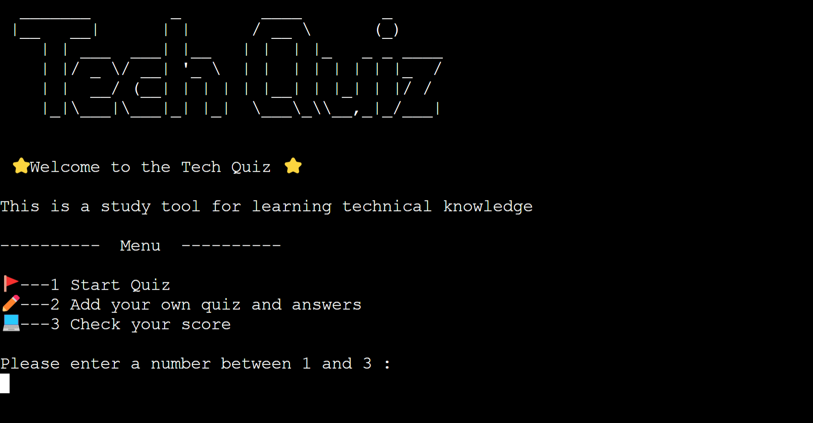
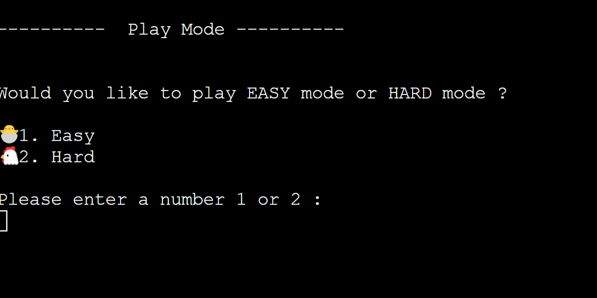
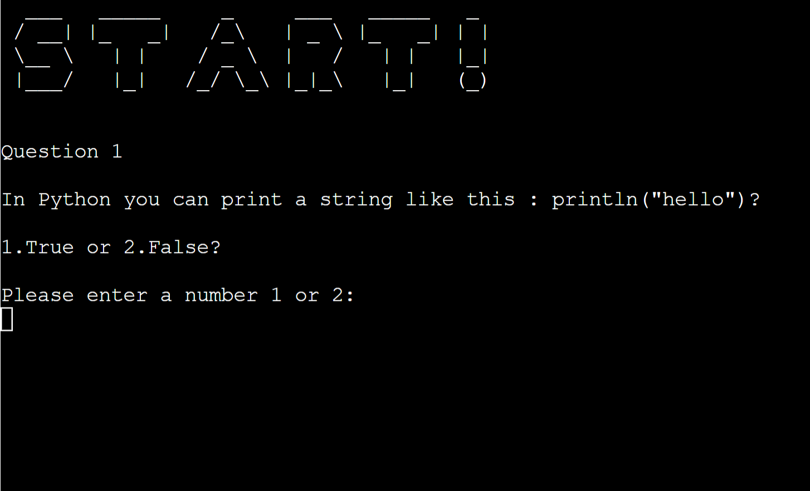

# Tech Quiz

GitHub https://github.com/Chikayo-k/tech-quiz

## Project Goals

The goal of this project is to create a simple and interactive Python game where users can test their programming skills and knowledge.

## Target Audience

- Students studying in the Software Development and Engineering
- Professionals looking to up skills in new technology stacks
- Teachers as a means to help students learn the basics of programming

## User Goals

- Students looking to learn programming knowledge
- Teachers as a learning tool in the classroom
- Professionals looking to learn new knowledge and up-skill
- Short focused quiz to help build programming knowledge
- Provides users with different levels of difficulty
- Provides users with the option to create their own quizzes

## User Stories

Game

1. As a user I want to build my knowledge around programming terms and topics
2. As a user I want to see the menu so I can select an option
3. As a user I want to be able to track my attempts
4. As a user I want to be able to have different levels of difficulty to help me progress.
5. As a user I want to be able to build my own quizzes to learn new things
6. As a user I want a simple experience when answering questions.
7. As a user I want instant visual feedback when answering questions.
8. As a user I want to see my score at the end of each round.

Scoreboard

9. As a user I want to see my scores
10. As a user I want to see my average score

Adding Questions

11. As a user I want to add new questions
12. As a user I want to choose the level where the questions will go
13. As a user I want easy navigation when adding questions
14. As a user I want to see a success message to let me know that a question has been added to the quiz

## Features To Achieve These Goals

Game

1. Provide a technical quiz game
2. Provide users with a menu.
3. Provide users with a scorer board to track the attempts
4. Provide different levels of difficulty
5. Provide users the option to add their questions and add them to the existing quizzes
6. Provide a simple and quick way of answering questions
7. Provide visual feedback in the form of emojis.
8. Provide the user with their score at the end of each set of questions

Scoreboard

9. Provide the last 5 scores.
10. Provide the user with an average score from the last 5 attempts

Adding Questions

11. Provide the user with the option to add new questions to the quiz
12. Provide the user the option where to add the questions in the easy or hard quizzes
13. Provide the user simple way to add questions
14. Provide the user with a message so they know the questions has been added successfully.

## Features

Home Screen

- Has a welcome message to users what the application is for.
- Display the home screen menu
- Gives the user 3 options to choose from
- The three options are to start the game, Check their score or add questions to create their own quiz.

Using text art and emojis the user can get the feeling it is a game. The welcome screen shows the user what kind of quiz this is and what they can expect.  
The game was designed so that users can enjoy the quiz with minimal input. Using only the number pad they can choose from 3 different options.

Start Quiz

- Easy mode
- Hard mode

The user can select from either easy or hard depending on their skill level. The questions will be pulled from an external spreadsheet using the google spreadsheet API. Which contains sets of questions for each.

- Display text art
- The questions will display on the screen and ask the user to enter either true or false by choosing either 1 or 2.

Using text art the user can see this is the start of the game.
This is again to simplify the user's experience by only having 2 options to choose from.

